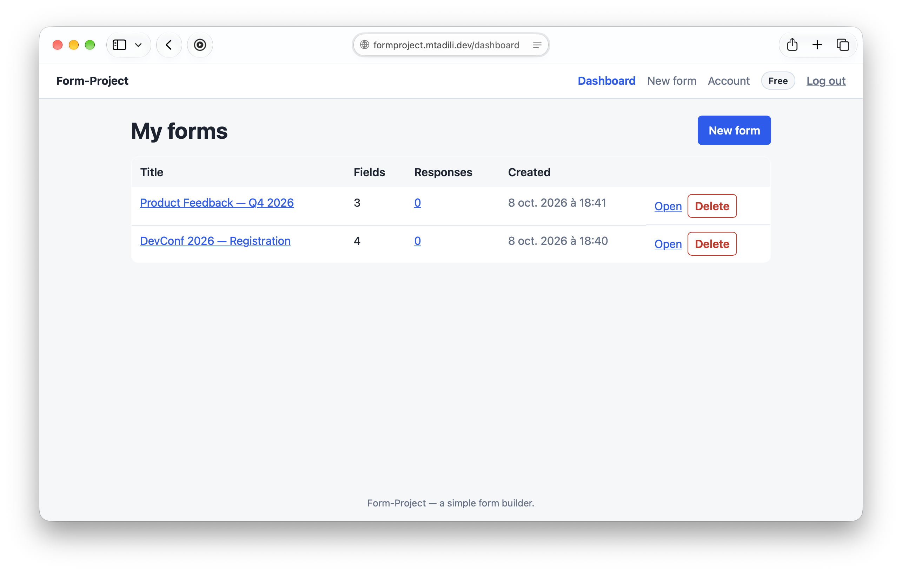
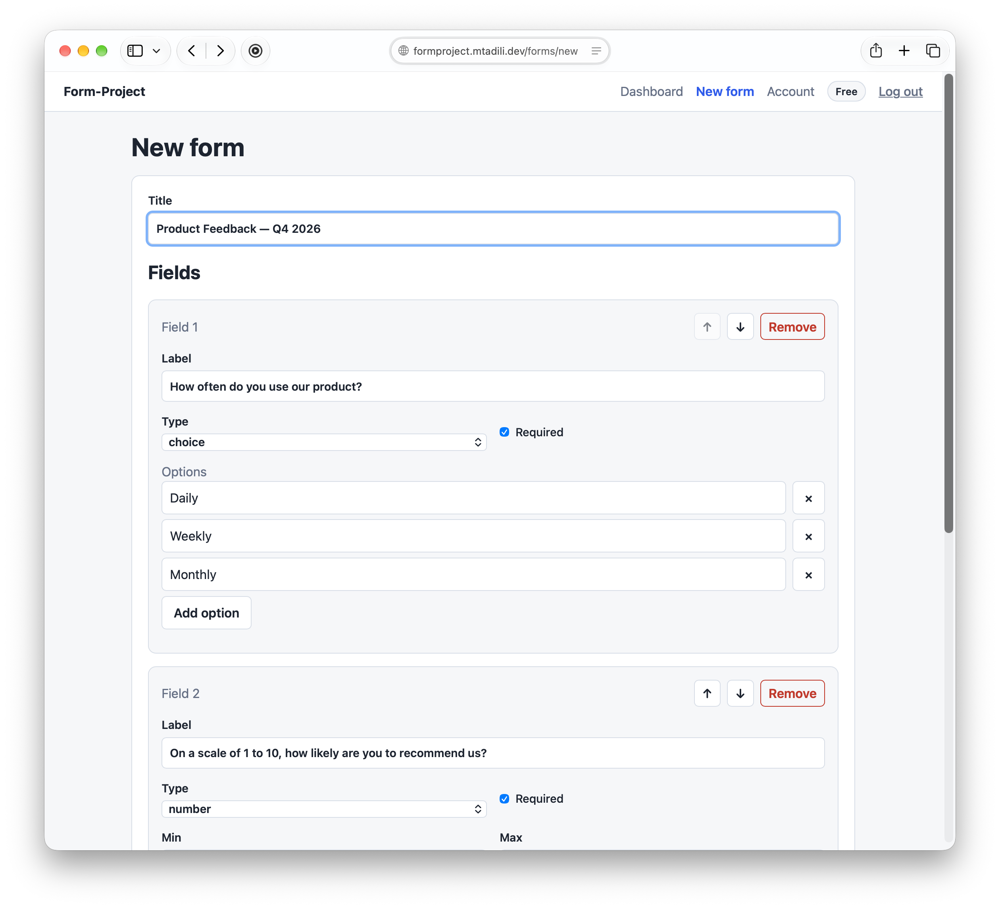
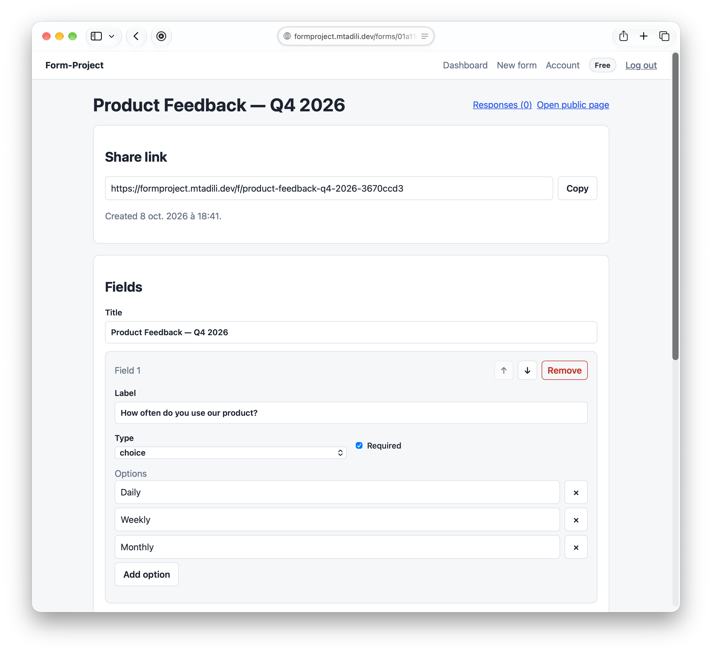
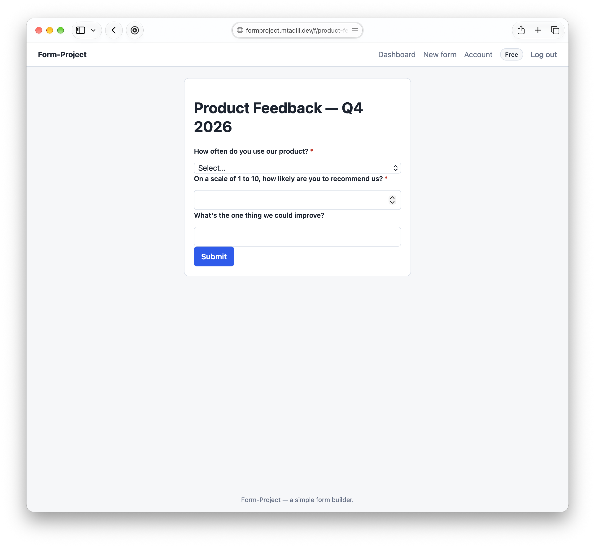

# Form-Project

[](https://github.com/TadiliM/Form-Project/actions/workflows/ci.yaml)

🔗 **Online Demo** : [formproject.mtadili.dev](https://formproject.mtadili.dev)

A form builder with custom fields and a paid Pro subscription. Users create forms,
share them through a public link, collect responses, and upgrade from the Free plan
through Stripe Checkout.

## Features

- Email/password accounts secured with JWT and BCrypt password hashing
- Form builder with three field types: text, single choice and number
- Public form pages addressed by slug — respondents do not need an account
- Response dashboard for form owners
- Freemium model: the Free plan is limited to 3 forms, the Pro plan removes the limit
- Stripe Checkout for subscriptions and signed webhooks for their lifecycle
  (`checkout.session.completed`, `customer.subscription.deleted`, `invoice.paid`)

## Tech stack

- **Backend:** ASP.NET Core (.NET 10), Entity Framework Core
- **Database:** PostgreSQL 16
- **Authentication:** JWT (7-day tokens), BCrypt password hashing
- **Payments:** Stripe (Checkout Sessions + webhooks)
- **Frontend:** React 19 + TypeScript, Vite
- **Containers:** Docker / Docker Compose, Caddy (HTTPS)
- **Tests:** xUnit + Testcontainers (backend), Vitest + jsdom (frontend)

## Architecture

```
backend/
├── backend/                  # API project
│   ├── Models/               # Entities: User, Form, Field (TPH: Text/Choice/Number),
│   │                         #   FormResponse, Answer, Subscription
│   ├── Data/                 # AppDbContext: relations, cascades, migrations
│   ├── Services/             # Business logic: AuthService, UserService,
│   │                         #   FormService, SubscriptionsService (+ interfaces)
│   ├── Controllers/          # REST endpoints
│   └── Migrations/           # EF Core migrations
└── backend.Tests/            # Integration tests for the services

frontend/                     # React SPA served by Caddy in production
```

Controllers only translate HTTP to service calls: business rules (validation,
ownership checks, plan limits, slug generation) live in the services and models.

## Technical highlights

A few decisions worth noting:

- **Idempotent Stripe webhooks.** The same `checkout.session.completed` event can be
  delivered multiple times. The subscription is only created if its
  `StripeSubscriptionId` is not already in the database, so replays are safe.

- **Webhook + client-side confirmation.** Stripe webhooks cannot reach `localhost`,
  so the payment is also confirmed by the frontend on `/success` by calling
  `POST /api/subscriptions/confirm`. The endpoint re-checks the session against
  Stripe's API and verifies that it belongs to the caller — a webhook alone is not
  enough for a reliable UX.

- **Freemium limit read from the database, not the JWT.** The plan claim inside a
  JWT is a snapshot from login time. After an upgrade, it stays stale until the
  token expires. Every limit check (`FormService.CreateAsync`) reads the current
  `PlanType` from PostgreSQL.

- **Field inheritance with TPH.** `TextField`, `ChoiceField`, and `NumberField`
  share a single `Fields` table with a `Discriminator` column. Field-specific
  columns are nullable, and validation is polymorphic through `Field.Validate(value)`.

- **`ON DELETE RESTRICT` for `Answer → Field`.** Deleting a field that has already
  received answers would silently destroy user data. The database refuses the
  deletion, and `FormService.DeleteAsync` deletes responses first, then the form.

## Screenshots

| Dashboard | Form builder |
| --- | --- |
|  |  |

**Finished Form**


**Public form** (respondent view, no account required)



## API overview

All routes are prefixed with `/api`. Protected routes require
`Authorization: Bearer <jwt>`.

### Authentication

| Method | Route | Auth | Description |
| --- | --- | --- | --- |
| POST | `/auth/register` | — | Creates an account and returns a JWT |
| POST | `/auth/login` | — | Returns a JWT and the profile |

### Forms (creator)

| Method | Route | Auth | Description |
| --- | --- | --- | --- |
| GET | `/forms` | JWT | Lists the caller's forms |
| POST | `/forms` | JWT | Creates a form (Free plan: max 3) |
| GET | `/forms/{id}` | JWT | Form detail with its fields |
| PUT | `/forms/{id}` | JWT | Updates title and fields |
| DELETE | `/forms/{id}` | JWT | Deletes the form and its responses |
| GET | `/forms/{id}/responses` | JWT | Responses with field labels |

### Forms (public, no account)

| Method | Route | Auth | Description |
| --- | --- | --- | --- |
| GET | `/forms/public/{slug}` | — | Public form definition |
| POST | `/forms/public/{slug}/responses` | — | Submits a response |

### Users

| Method | Route | Auth | Description |
| --- | --- | --- | --- |
| GET | `/users/me` | JWT | Current profile (up-to-date plan) |
| PUT | `/users/me` | JWT | Updates the display name |

### Subscriptions

| Method | Route | Auth | Description |
| --- | --- | --- | --- |
| POST | `/subscriptions/checkout` | JWT | Creates a Stripe Checkout session |
| POST | `/subscriptions/confirm` | JWT | Re-checks a paid session and activates the plan |
| POST | `/subscriptions/cancel` | JWT | Cancels the active subscription |
| POST | `/subscriptions/webhook` | Stripe signature | Receives Stripe events |

### Health

| Method | Route | Auth | Description |
| --- | --- | --- | --- |
| GET | `/health` | — | Liveness probe (Docker healthcheck, uptime monitor) |

Errors are returned as `{ "message": "..." }`: `404` not found, `400` invalid
operation, `401` bad credentials, `409` email already in use.

## Getting started

### Quick start

```bash
git clone https://github.com/TadiliM/Form-Project.git
cd Form-Project
cp .env.example .env
docker compose up -d --build
dotnet ef database update --project backend/backend
```

The API is available at `http://localhost:5050`, PostgreSQL at `localhost:5433`.

> For the full configuration (JWT keys, Stripe credentials, environment variables),
> see the detailed instructions below.

### Prerequisites

- .NET SDK 10
- Docker (Docker Desktop) — for PostgreSQL and for the test suite
- The EF Core CLI: `dotnet tool install --global dotnet-ef`

### Configuration

1. Create a `.env` file at the repository root with the database credentials used
   by Docker Compose:

   ```
   POSTGRES_DB=formproject
   POSTGRES_USER=formproject
   POSTGRES_PASSWORD=change-me
   ```

2. Create `backend/backend/appsettings.Development.json` (not versioned) with the
   connection string, the JWT settings and the Stripe keys:

   ```json
   {
     "ConnectionStrings": {
       "DefaultConnection": "Host=localhost;Port=5433;Database=formproject;Username=formproject;Password=change-me"
     },
     "Jwt": {
       "Key": "a-long-random-secret-at-least-32-characters",
       "Issuer": "form-project",
       "Audience": "form-project-clients"
     },
     "Stripe": {
       "SecretKey": "sk_test_...",
       "PublishableKey": "pk_test_...",
       "PriceId": "price_...",
       "WebhookSecret": "whsec_..."
     }
   }
   ```

### Run the stack

```bash
docker compose up -d --build                                        # API + PostgreSQL
dotnet ef database update --project backend/backend                 # apply the migrations
```

The API is then available at `http://localhost:5050` and PostgreSQL at
`localhost:5433`. To run the API without Docker (database still in Docker), use the
`http` launch profile, which listens on `http://localhost:5095`:

```bash
dotnet run --project backend/backend
```

### Run the tests

| Suite | Tool | Count | Purpose |
| --- | --- | --- | --- |
| Backend | xUnit + Testcontainers (real PostgreSQL 16) | 77 tests | Business logic: freemium limit, ownership, Stripe webhooks, form validation |
| Frontend | Vitest + jsdom | 48 tests | Validation helpers, API client, auth context, field rendering |

```bash
# Backend (Docker must be running for Testcontainers)
dotnet test backend/backend.Tests/backend.Tests.csproj

# Frontend
cd frontend
npm test
```

The backend suite starts a throwaway `postgres:16` container per test — not a
mocked database — so cascading deletes, foreign-key restrictions, and TPH
inheritance are exercised against the real engine.

All tests run automatically on every push via GitHub Actions.

## Deployment

The application is deployed on a single Hetzner Cloud VM (CX23, Ubuntu 24.04) using:

- **Docker Compose** to orchestrate the API, PostgreSQL 16, and Caddy
- **Caddy** as a reverse proxy with automatic HTTPS (Let's Encrypt)
- **Custom domain**: [formproject.mtadili.dev](https://formproject.mtadili.dev)

### CI/CD pipeline

Every push to `main` runs the GitHub Actions workflow:

1. **Backend job** — `dotnet restore`, `build`, and `test` against a real PostgreSQL
   via Testcontainers.
2. **Frontend job** — `npm ci`, TypeScript typecheck (`tsc --noEmit`), and Vitest.
3. **Deploy job** — runs only if both jobs pass. It connects to the VM over SSH,
   pulls the latest code, rebuilds the frontend, and restarts the Docker Compose
   stack.

This keeps the deployed version always in sync with `main`, with zero manual
intervention.

## Plans and limits

| | Free | Pro |
| --- | --- | --- |
| Forms | 3 | Unlimited |
| Price | — | Recurring monthly via Stripe |

The plan is read from the database on every call, so a subscription change takes
effect immediately — the `planType` claim inside a JWT is only a snapshot from
login time.
